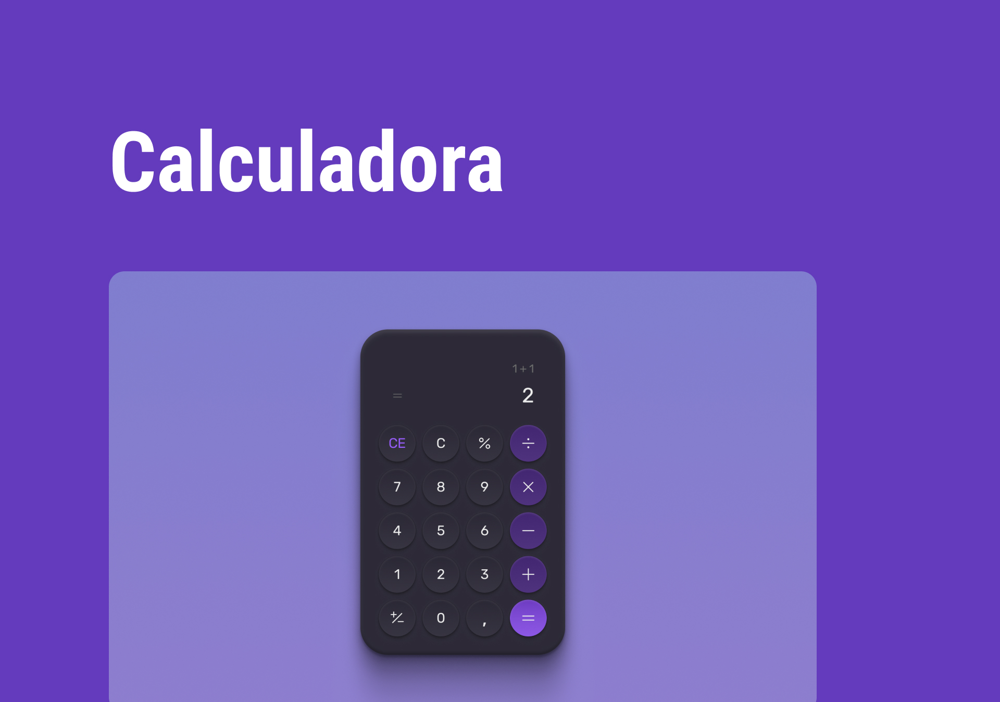
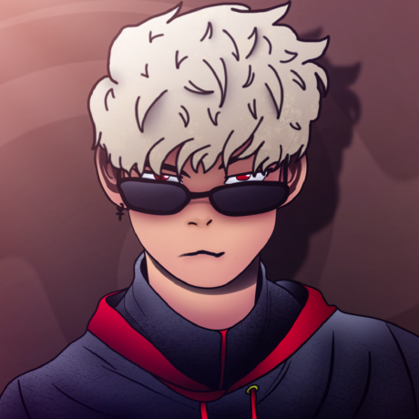

<h3 align="center">DESAFIO ROCKETSEAT</h3>
<h1 align="center">
  
</h1>

<a href="https://boracodar-calculator.vercel.app" target="_blank">
  Deploy do Projeto 🔗
</a>

 

##  🖼️ Banner de apresentação

---

## 💻 Projeto

Uma Calculadora.

Este foi um projeto desenvolvido como resposta ao desafio #5 do **[boracodar](https://boracodar.dev/#)**.

---

##  📱 Contate-me!

  
Código desenvolvido por <a href="https://github.com/daviaxs" target="_blank">Davi Alves</a>

  

---

##  💡 Tecnologias utilizadas

> ReactJS

> CSS

> Vite

> Git e Github

---

  ##  ✒️ Autor

<a href="https://github.com/daviaxs">
  
   
  <b>Davi Alves</b>
</a>
 